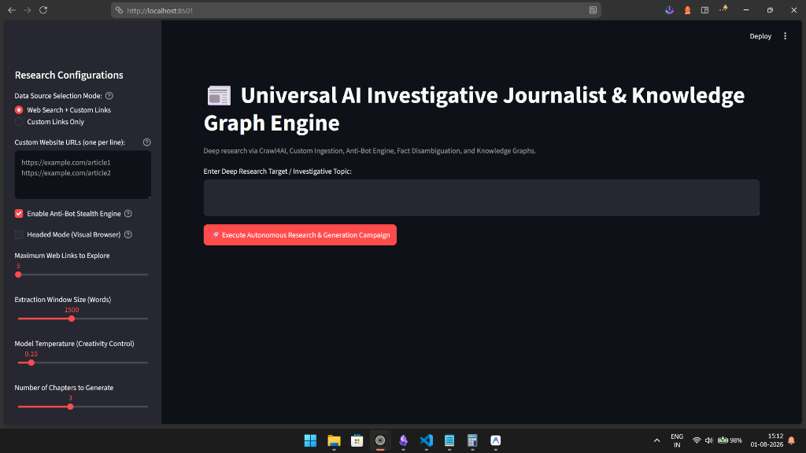

# Changelog

All notable changes to this project will be documented in this file.

The format is based on [Keep a Changelog](https://keepachangelog.com/en/1.1.0/),
and this project adheres to [Semantic Versioning](https://semver.org/spec/v2.0.0.html).

## [Unreleased]

### UI Preview

> Application running at `localhost:8501` — Streamlit-powered research interface.

---

### Added
- **Custom Ingestion & Crawl Engine**: 
  - Added support for pasting custom URLs with auto-cleaning and automatic GitHub README direct-raw resolution (`parse_and_clean_urls`).
  - Added integration with `Crawl4AI` (`AsyncWebCrawler`) for automated headless browser page navigation and raw markdown extraction.
  - Introduced **Anti-Bot Stealth Engine** options and a **Headed Mode (Visual Browser)** interactive fallback checkbox.
  - Added data source selection modes (`Web Search + Custom Links` vs `Custom Links Only`).
- **UI State Locking**:
  - Added full input locking (`disabled=st.session_state.is_running`) across all controls and text areas (`topic`, sidebar options, sliders) during execution.
- **Single Chapter Support**:
  - Allowed generating single-chapter reports by updating the `num_chapters` slider minimum value to `1`.

### Fixed
- Fixed race conditions and double-trigger execution bugs on the main run button by maintaining pipeline execution state in `st.session_state.is_running`.